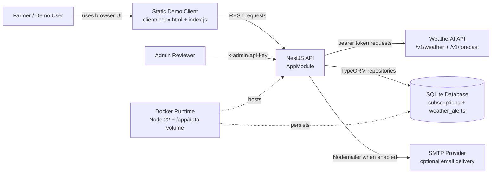
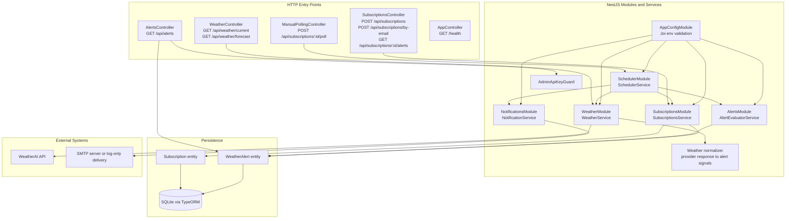
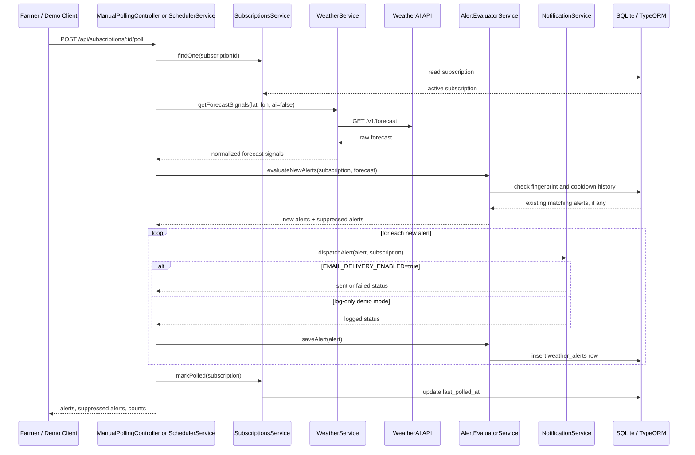
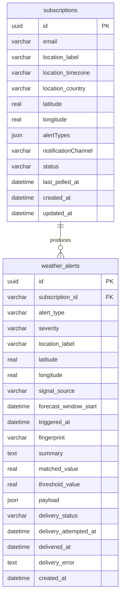

# WeatherAI Alert Subscription Service Architecture

## System Context

## Application Components

## Alert Polling Flow

## Data Model

## Notes

- `WeatherService` owns WeatherAI authentication, base URL configuration, and upstream error mapping.
- Forecast polling uses `ai=false` because the alert engine only needs numeric/provider-neutral signals.
- `AlertEvaluatorService` keeps alert thresholds, strongest-match selection, fingerprint deduplication, and cooldown suppression behind one service boundary.
- `NotificationService` is the delivery boundary. It sends through SMTP when enabled and logs the notification payload in demo mode.
- SQLite is created through TypeORM and persists in `data/` locally or `/app/data` in Docker.
