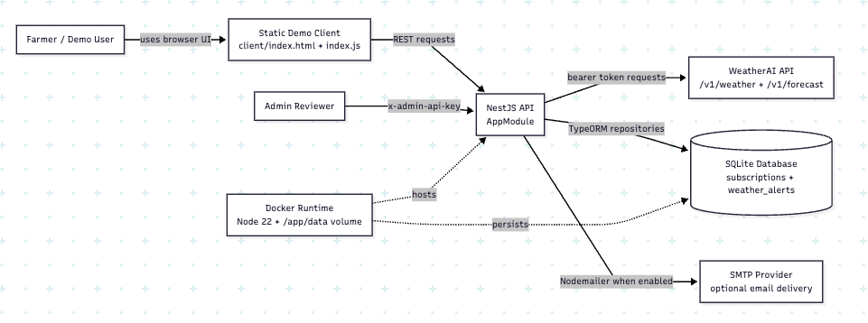
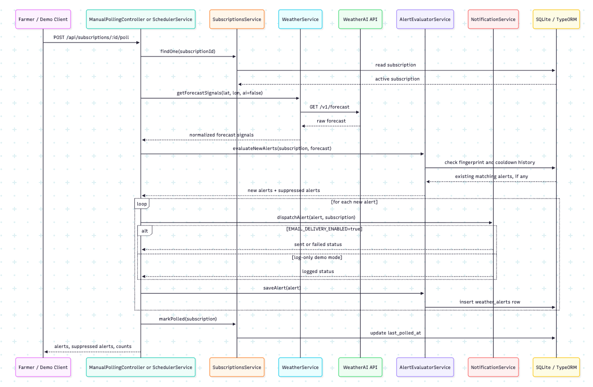

# WeatherAI Alert Subscription Service

WeatherAI Alert Subscription Service is a small alerting system for farmers managing weather risk across multiple farms or plots of land. A farmer can subscribe an email address to different farm locations, choose the alert types that matter for each location, and review alerts tied back to the subscription that triggered them.

The backend integrates with WeatherAI forecast data, normalizes raw weather fields into alert signals, evaluates those signals against configurable rules, suppresses duplicate alerts, persists alert history, and delivers or logs notifications. The implementation is intentionally compact, but it shows the parts that matter for a real alerting workflow: API consumption, quota-aware polling, deduplication, durable records, and a delivery boundary that can later support stronger notification channels.

I also included a lightweight client application for demo purposes. The UI is not the core of the assessment; it exists so you can experience the farmer workflow quickly without piecing the journey together from curl commands.

## Table of Contents

- [Live Deployment](#live-deployment)
- [Demo Walkthrough](#demo-walkthrough)
- [Technology Stack](#technology-stack)
- [Project Structure](#project-structure)
- [Use Case Flow](#use-case-flow)
- [Why This Architecture](#why-this-architecture)
- [Architecture Diagrams](#architecture-diagrams)
  - [System Context](#system-context)
  - [Alert Polling Flow](#alert-polling-flow)
- [Quota Strategy](#quota-strategy)
- [Request Flow](#request-flow)
- [Database Structure](#database-structure)
  - [`subscriptions`](#subscriptions)
  - [`weather_alerts`](#weather_alerts)
- [Client Application](#client-application)
- [Environment Variables](#environment-variables)
- [Local Setup](#local-setup)
- [Curl Examples](#curl-examples)
- [Deployment Notes](#deployment-notes)
- [Production Improvements](#production-improvements)
- [Summary](#summary)

## Live Deployment

- Client: https://taofeeq-weather-ai.netlify.app/
- Backend API: https://weather-ai.taoforge.org

## Demo Walkthrough

The fastest way to evaluate the project is through the deployed client:

1. Open the client and enter an email address for the farmer.
2. Create subscriptions for one or more farms using labels and coordinates.
3. Choose alert types per farm, such as heavy rain, frost, storm, heat, or wind.
4. Trigger a manual poll for a subscription during the demo.
5. View alert history for the selected farm subscription.

The same workflow is available through the API examples below. The client is only a demo surface; the backend remains the source of truth for subscriptions, polling, alert evaluation, notification logging, and alert history.

## Technology Stack

| Layer | Technology | Purpose |
|---|---|---|
| Backend framework | NestJS, TypeScript | Modular HTTP API, services, dependency injection, validation, and scheduler wiring. |
| HTTP client | `@nestjs/axios`, Axios, RxJS | Calls WeatherAI endpoints with centralized error handling. |
| Persistence | SQLite, TypeORM | Stores farm subscriptions, alert history, delivery state, and polling timestamps. |
| Scheduling | `@nestjs/schedule` | Runs optional interval-based background polling for active subscriptions. |
| Validation/config | `class-validator`, `class-transformer`, Joi, `@nestjs/config` | Validates request DTOs and environment variables. |
| Notifications | Nodemailer | Sends SMTP email when enabled, or logs notifications in demo mode. |
| Demo client | HTML, CSS, vanilla JavaScript | Provides a lightweight browser UI for the farmer workflow. |
| Testing | Jest, Supertest | Covers unit and end-to-end API behavior. |
| Runtime/deployment | Node.js 22, Docker, Docker Compose | Runs the API locally or in a container with a durable SQLite volume. |

## Project Structure

```text
src/
  alerts/           Alert rules, alert history API, and WeatherAlert entity
  common/           Shared guards, including admin API key protection
  config/           Environment validation, app config, CORS, and database path helpers
  database/         TypeORM setup and SQLite migrations
  notifications/    Email/log delivery boundary
  scheduler/        Scheduled and manual alert polling flow
  subscriptions/    Farm subscription API, service, and Subscription entity
  weather/          WeatherAI API client, DTOs, normalizer, and provider types
client/             Static demo client
data/               Local SQLite database files
test/               End-to-end tests
```

## Use Case Flow

1. A farmer subscribes an email address to one or more farm locations.
2. Each farm subscription can track its own alert types, such as heavy rain, frost, storm, heat, or wind.
3. The backend polls WeatherAI forecast data for active subscription locations.
4. The forecast response is normalized into a provider-neutral signal format.
5. The alert engine checks each signal against configurable thresholds.
6. The strongest alert per alert type is selected for the poll cycle.
7. Duplicate alerts are suppressed with fingerprints and cooldown windows.
8. Alerts are persisted in SQLite and linked back to the subscription that triggered them.
9. Email delivery is attempted when SMTP (EMAIL_DELIVERY_ENABLED) is enabled; otherwise the alert is logged for demo safety.

Supported alert types:

- `heavy_rain`
- `extreme_heat`
- `frost_warning`
- `storm_alert`
- `high_wind`

## Why This Architecture

The implementation focuses on the backend decisions that matter for this kind of product: using WeatherAI responsibly, keeping the alert engine independent from provider response shape, reducing noisy duplicate alerts, and making delivery replaceable.

| Design concern | Decision |
|---|---|
| WeatherAI quota is limited | Poll conservatively and cap demo subscriptions |
| WeatherAI AI summaries are enabled by default | Let user-facing weather lookups use the provider default; disable AI only for background polling |
| Provider data may change shape over time | Normalize forecast responses before alert evaluation |
| Polling can rediscover the same bad weather window | Store alert fingerprints and apply cooldown windows |
| Delivery channels may change | Keep email/logging behind a `NotificationService` boundary |
| Demo should be easy to review | Provide a small client while keeping the backend as the core system |

This keeps the demo honest: it uses the accessible WeatherAI API, respects free-tier constraints, and still models the backend workflow a production alert service would need.

## Architecture Diagrams

The diagrams below were generated from the Mermaid architecture definitions in [ARCHITECTURE.md](ARCHITECTURE.md).

### System Context



### Alert Polling Flow



## Quota Strategy

The assessment assumes a WeatherAI budget of about `1,000` calls per month, or roughly `33` calls per day. This app makes one forecast call per subscribed location during each poll cycle.

The default demo settings are conservative: `POLL_INTERVAL_MINUTES=360` and `MAX_DEMO_SUBSCRIPTIONS=3`. At that setting, scheduled polling uses about `360` forecast calls per month, leaving room for manual testing, retries, deployment checks, and hands-on exploration.

WeatherAI documents AI summaries as enabled by default on user-facing weather endpoints. The app does not force `ai=false` for explicit current-weather and forecast lookups, so it stays aligned with that provider default. Background alert polling passes `ai=false` because the scheduler only needs numeric forecast signals and should not spend the separate AI quota.

## Request Flow

```text
POST /api/subscriptions
  -> validates and stores a farm alert subscription

GET /api/weather/current or GET /api/weather/forecast
  -> WeatherService calls WeatherAI with the provider's default AI behavior
  -> current conditions or forecast details are returned for the requested coordinates

POST /api/subscriptions/:id/poll or scheduled poll
  -> WeatherService calls WeatherAI /v1/forecast with ai=false
  -> forecast data is normalized into alert signals
  -> alert rules create or suppress alert candidates
  -> NotificationService sends email or logs the demo notification
  -> WeatherAlert history is saved in SQLite

GET /api/subscriptions/:id/alerts
  -> returns alert history for one farm subscription

GET /api/alerts
  -> admin-only alert history lookup
```

## Database Structure

The database is intentionally small because the workflow only needs to remember two durable things: what each farmer wants monitored, and which alerts were produced from those monitoring runs. SQLite is enough for the assessment demo, while the entity boundaries still map cleanly to a production database later.

### `subscriptions`

The `subscriptions` entity represents a farmer's alert request for one farm location. I kept this as the root record because the same email address can care about different plots, and each plot may need its own coordinates, label, selected alert types, and polling state.

There is a unique index across `email`, `latitude`, and `longitude` so the same farmer does not accidentally create duplicate subscriptions for the same location.

| Column | Purpose |
|---|---|
| `id` | UUID primary key used by API routes, polling jobs, and alert history lookups. |
| `email` | Farmer email address used as the subscriber identity and current notification target. |
| `location_label` | Human-readable farm or place name shown in alerts and the client UI. |
| `location_timezone` | Optional timezone from the provider or client context, kept for future local-time alert presentation. |
| `location_country` | Optional country metadata for filtering, display, or later regional behavior. |
| `latitude` | Farm latitude used for WeatherAI forecast requests. |
| `longitude` | Farm longitude used for WeatherAI forecast requests. |
| `alertTypes` | JSON array of enabled alert types for this farm, such as `heavy_rain`, `storm_alert`, or `high_wind`. |
| `notificationChannel` | Delivery channel for the subscription. It is currently `email`, but stored explicitly so more channels can be added behind the notification boundary. |
| `status` | Subscription lifecycle state. `active` records are pollable; `paused` records can be kept without being evaluated. |
| `last_polled_at` | Timestamp of the most recent poll, useful for scheduler behavior and operational visibility. |
| `created_at` | Timestamp created by TypeORM when the subscription is first stored. |
| `updated_at` | Timestamp updated by TypeORM whenever the subscription changes. |

### `weather_alerts`

The `weather_alerts` entity is the durable history of alert decisions. It stores not just that an alert happened, but the signal window, threshold comparison, deduplication fingerprint, and notification outcome. That makes the alert feed explainable during review and gives the delivery layer a clear audit trail.

Alerts belong to a subscription and are deleted when the subscription is deleted. A unique index across `subscription_id`, `alert_type`, and `fingerprint` prevents the same weather event from being stored repeatedly, while the `subscription_id`, `alert_type`, and `triggered_at` index keeps recent history lookups efficient.

| Column | Purpose |
|---|---|
| `id` | UUID primary key for the stored alert event. |
| `subscription_id` | Foreign key linking the alert back to the farm subscription that triggered it. |
| `alert_type` | Alert category that matched, using the same values configured on subscriptions. |
| `severity` | Normalized severity level (`info`, `watch`, `warning`, or `critical`) for sorting and presentation. |
| `location_label` | Snapshot of the subscription label at alert time, so history remains readable even if the subscription changes later. |
| `latitude` | Snapshot of the monitored latitude used for the forecast request. |
| `longitude` | Snapshot of the monitored longitude used for the forecast request. |
| `signal_source` | Indicates which normalized forecast signal produced the alert. |
| `forecast_window_start` | Start time of the forecast window that matched the rule. |
| `triggered_at` | Time the backend created the alert decision. |
| `fingerprint` | Stable deduplication key for suppressing repeated alerts from the same weather window. |
| `summary` | Human-readable alert message used by the API response and notification payload. |
| `matched_value` | Weather value that crossed the rule threshold, such as rain amount, temperature, or wind speed. |
| `threshold_value` | Configured threshold that the matched value was compared against. |
| `payload` | Optional JSON payload with extra provider-neutral context for debugging or richer clients. |
| `delivery_status` | Current delivery state: `pending`, `logged`, `sent`, or `failed`. |
| `delivery_attempted_at` | Timestamp for the latest notification attempt. |
| `delivered_at` | Timestamp set when delivery succeeds. |
| `delivery_error` | Error details captured when notification delivery fails. |
| `created_at` | Timestamp created by TypeORM when the alert record is stored. |

## Client Application

The `client/` folder contains the static demo app used by the deployed client. For local demos, start the API and open `client/index.html` in a browser. The client defaults to `http://localhost:3000` locally and to the deployed backend when served from the Netlify demo host. The API base URL can also be edited inside the UI.

The client treats the latitude and longitude form as the active location context. When the coordinates are valid, it automatically loads current weather with a short debounce, including coordinates filled by browser geolocation. The forecast preview remains available as a manual action for checking the next few days before creating or reviewing a subscription. If a weather response includes the existing `summary` field, the client displays it above the metric grid.

## Environment Variables

Required outside `NODE_ENV=test`:

| Variable | Example | Purpose |
|---|---|---|
| `ADMIN_API_KEY` | `change-me-admin-key` | Protects admin endpoints. |
| `WEATHER_AI_API_KEY` | `wai_live_xxx` | Bearer token for WeatherAI API calls. |

Common optional variables:

| Variable | Default | Purpose |
|---|---|---|
| `PORT` | `3000` | HTTP server port. |
| `WEATHER_AI_BASE_URL` | `https://api.weather-ai.co` | WeatherAI API base URL. |
| `DATABASE_PATH` | Environment-specific | SQLite database file. Defaults to `data/weather-ai.development.sqlite`, `data/weather-ai.test.sqlite`, or `data/weather-ai.production.sqlite` based on `NODE_ENV`. |
| `SCHEDULER_ENABLED` | `false` | Enables automatic forecast polling. |
| `POLL_INTERVAL_MINUTES` | `360` | Poll interval. Minimum allowed value is `30`. |
| `MAX_DEMO_SUBSCRIPTIONS` | `3` | Demo cap to protect free-tier quota. |
| `ALERT_COOLDOWN_HOURS` | `12` | Suppresses repeated alerts of the same type. |
| `EMAIL_DELIVERY_ENABLED` | `false` | Sends real SMTP email when `true`; logs payload when `false`. |

Alert threshold variables:

| Variable | Default |
|---|---:|
| `HEAVY_RAIN_MM_THRESHOLD` | `25` |
| `RAIN_PROBABILITY_THRESHOLD` | `80` |
| `EXTREME_HEAT_C_THRESHOLD` | `35` |
| `FROST_C_THRESHOLD` | `2` |
| `HIGH_WIND_KPH_THRESHOLD` | `40` |
| `WIND_GUST_KPH_THRESHOLD` | `60` |
| `STORM_CONDITION_CODES` | `95,96,99` |

SMTP variables required only when `EMAIL_DELIVERY_ENABLED=true`:

| Variable | Example |
|---|---|
| `SMTP_HOST` | `smtp.gmail.com` |
| `SMTP_PORT` | `587` |
| `SMTP_SECURE` | `false` |
| `SMTP_USER` | `alerts@example.com` |
| `SMTP_PASS` | `app-password` |
| `SMTP_FROM` | `alerts@example.com` |

## Local Setup

Install dependencies:

```bash
npm install
```

Start with safe demo settings:

```bash
ADMIN_API_KEY=local-admin-key \
WEATHER_AI_API_KEY=your-weatherai-api-key \
SCHEDULER_ENABLED=false \
EMAIL_DELIVERY_ENABLED=false \
npm run start:dev
```

The API will be available at:

```text
http://localhost:3000
```

Run tests:

```bash
npm test
npm run test:e2e
```

Tests use a separate SQLite file:

```text
data/weather-ai.test.sqlite
```

Build:

```bash
npm run build
```

Run production build:

```bash
npm run start:prod
```

By default, each runtime environment uses a separate SQLite file:

| Environment | Default SQLite path |
|---|---|
| `development` | `data/weather-ai.development.sqlite` |
| `test` | `data/weather-ai.test.sqlite` |
| `production` | `data/weather-ai.production.sqlite` |

You can override this with `DATABASE_PATH` when needed.

## Curl Examples

Set local shell variables:

```bash
BASE_URL=http://localhost:3000
ADMIN_API_KEY=local-admin-key
```

For the deployed backend, use:

```bash
BASE_URL=https://weather-ai.taoforge.org
```

### Check current weather through WeatherAI

```bash
curl "$BASE_URL/api/weather/current?lat=-1.286&lon=36.817"
```

Add `ai=false` only when you want to skip WeatherAI's AI summary for a manual lookup:

```bash
curl "$BASE_URL/api/weather/current?lat=-1.286&lon=36.817&ai=false"
```

### Fetch forecast through WeatherAI

```bash
curl "$BASE_URL/api/weather/forecast?lat=-1.286&lon=36.817&days=3"
```

### Create a subscription

```bash
curl -X POST "$BASE_URL/api/subscriptions" \
  -H "Content-Type: application/json" \
  -d '{
    "email": "farmer@example.com",
    "location": {
      "label": "Nairobi CBD",
      "lat": -1.286,
      "lon": 36.817
    },
    "alerts": ["heavy_rain", "storm_alert", "high_wind"]
  }'
```

### Get one subscription

Replace `<subscription_id>` with the `id` returned from create.

```bash
curl "$BASE_URL/api/subscriptions/<subscription_id>"
```

### List active subscriptions as admin

```bash
curl "$BASE_URL/api/subscriptions" \
  -H "x-admin-api-key: $ADMIN_API_KEY"
```

Bearer auth also works:

```bash
curl "$BASE_URL/api/subscriptions" \
  -H "Authorization: Bearer $ADMIN_API_KEY"
```

### Manually poll one subscription

Replace `<subscription_id>` with the `id` returned from create. This triggers the same alert evaluation and notification/logging flow used by the scheduler.

```bash
curl -X POST "$BASE_URL/api/subscriptions/<subscription_id>/poll"
```

### List alert history as admin

```bash
curl "$BASE_URL/api/alerts" \
  -H "x-admin-api-key: $ADMIN_API_KEY"
```

Filter by email:

```bash
curl "$BASE_URL/api/alerts?email=farmer@example.com" \
  -H "x-admin-api-key: $ADMIN_API_KEY"
```

Filter by location:

```bash
curl "$BASE_URL/api/alerts?location=Nairobi" \
  -H "x-admin-api-key: $ADMIN_API_KEY"
```

### Delete a subscription

```bash
curl -X DELETE "$BASE_URL/api/subscriptions/<subscription_id>"
```

## Deployment Notes

### Docker

Build the production image:

```bash
docker build -t weather-ai-assessment-backend .
```

Run it with a durable SQLite mount:

```bash
docker run --rm \
  -p 3000:3000 \
  -v weather_ai_data:/app/data \
  -e ADMIN_API_KEY=change-me-admin-key \
  -e WEATHER_AI_API_KEY=your-weatherai-api-key \
  -e SCHEDULER_ENABLED=false \
  -e EMAIL_DELIVERY_ENABLED=false \
  weather-ai-assessment-backend
```

Or use Docker Compose:

```bash
ADMIN_API_KEY=change-me-admin-key \
WEATHER_AI_API_KEY=your-weatherai-api-key \
docker compose up --build
```

The container stores production SQLite data at:

```text
/app/data/weather-ai.production.sqlite
```

The `docker-compose.yml` file mounts `/app/data` to a named volume so data survives container restarts. In `NODE_ENV=production`, TypeORM runs the initial schema migration and keeps `synchronize` disabled.

### Node hosts

For Render, Railway, Fly.io, or similar Node hosts:

1. Set the build command to:

```bash
npm install && npm run build
```

2. Set the start command to:

```bash
npm run start:prod
```

3. Add required environment variables:

```text
ADMIN_API_KEY=<strong random value>
WEATHER_AI_API_KEY=<WeatherAI key>
DATABASE_PATH=data/weather-ai.production.sqlite
SCHEDULER_ENABLED=false
EMAIL_DELIVERY_ENABLED=false
```

4. For a live scheduled demo, enable:

```text
SCHEDULER_ENABLED=true
POLL_INTERVAL_MINUTES=360
MAX_DEMO_SUBSCRIPTIONS=3
```

5. If the platform filesystem is ephemeral, mount a persistent disk or use a managed database. SQLite is fine for this assessment demo, but a deployed production service should use Postgres or another durable store.

## Production Improvements

If this were expanded beyond the assessment, the next steps would be:

- Replace SQLite with Postgres and a fuller migration workflow.
- Group subscriptions by coordinate so one WeatherAI call can serve many subscribers in the same location.
- Add retry/backoff for transient WeatherAI and SMTP failures.
- Add a queue for notification delivery.
- Add SMS/USSD delivery behind the existing notification boundary once the account has the required WeatherAI plan and approvals.
- Add a small admin dashboard for reviewing subscriptions, alert history, and quota usage.

## Summary

This project demonstrates a quota-aware WeatherAI integration with a realistic alerting workflow. The key design choice is that the app treats WeatherAI forecast data as an upstream signal, normalizes it, evaluates business rules locally, deduplicates noisy events, and keeps delivery transport replaceable.
